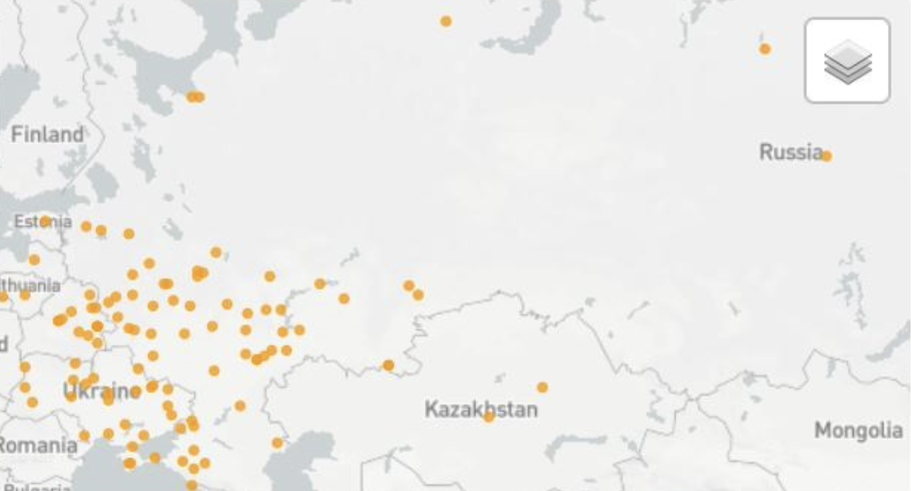

## Source
[Susan Grunewald and Andrew Janco, "Finding Places in Text with the World Historical Gazeteer"](https://programminghistorian.org/en/lessons/finding-places-world-historical-gazetteer)

## Reflection
The lesson introduced a few compelling methods which could be widely applicable across digital humanities studies. These methods included natural language processing with a choice of a natural language, models to show the relationship between people and places, and a visualization software.

The method of NLP used in this lesson could be immensely helpful for analysis of regions and histories with languages that are foreign to the researcher. In this lesson, libraries  specific to the German language were used, which I am completely unfamiliar with. However, using German language datasets, I was able to perform analysis on text I am completely unable to read. These methods could be used for a wide variety of languages, allowing more people to access and work with data from different regions of the world.

Another method that could be useful in other projects is the model to show relationships between people and places in a text. Using larger datasets, we are able to visualize connections between certain words, such as part of speech. This could be used to link a person to their geographical location, which could be very useful in other digital humanities projects.

Furthermore, this lesson introduced a website that could take a tsv file and show the locations mentioned on a world map. This could be immensely helpful in producing visualizations for the scope of a region that is investigated or mentioned in a particular analysis.


## Code

```python
text = "Siberia has many rivers."
for index, char in enumerate(text):
    print(index, char)
```

    0 S
    1 i
    2 b
    3 e
    4 r
    5 i
    6 a
    7  
    8 h
    9 a
    10 s
    11  
    12 m
    13 a
    14 n
    15 y
    16  
    17 r
    18 i
    19 v
    20 e
    21 r
    22 s
    23 .


```python
text = "Siberia has many rivers."
text.find("rivers")
```


    17


```python
#some natural language processing in german
from spacy.lang.de import German
nlp = German()
doc = nlp("Berlin ist eine Stadt in Deutschland.")
for token in doc:
    print(token.i, token.text)
```

    0 Berlin
    1 ist
    2 eine
    3 Stadt
    4 in
    5 Deutschland
    6 .


```python
# print gazeteer, the list of places
from pathlib import Path

gazetteer = Path("gazetteer.txt").read_text()
gazetteer = gazetteer.split("\n")

print(gazetteer)
```


```python
# Matching place names
# Find places in the text that occur in the gazetteer (our database)
from spacy.lang.de import German
from spacy.matcher import Matcher

nlp = German()

doc = nlp("Karl-Heinz Quade ist von März 1944 bis August 1948 im Lager 150 in Grjasowez interniert.")

matcher = Matcher(nlp.vocab)
for place in gazetteer:
    pattern = [{'LOWER': place.lower()}]
    matcher.add(place, [pattern])

matches = matcher(doc)
for match_id, start, end in matches:
    print(start, end, doc[start:end].text)
```

    13 14 Grjasowez


```python
# Case sensitive search
# Search for certain text followed by a number

pattern = [{'LOWER': 'lager'},  #the first token should be ‘lager’
           {'LIKE_NUM': True}] # the second token should be a number

# Add the pattern to the matcher
matcher.add("LAGER_PATTERN", [pattern])

matches = matcher(doc)
for match_id, start, end in matches:
    print(start, end, doc[start:end].text)
```

    10 12 Lager 150
    13 14 Grjasowez


```python
# Loading text files

# print filename, location, and name of place from the gazetteer that appears in
# the text
for file in Path('/Users/finntekverk/Desktop/everything/Tufts/Classes/Senior Year/First Semester/Digital Humanities/DHCode/ProgrammingHistorian/PH2/textfiles').iterdir():
    doc = nlp(file.read_text())
    matches = matcher(doc)
    for match_id, start, end in matches:
        print(file.name, start, end, doc[start:end].text)
```

    gazetteerabridged.txt 0 1 Armenien
    gazetteerabridged.txt 2 3 Aserbaidshan
    gazetteerabridged.txt 4 5 Aserbaidshen
    gazetteerabridged.txt 6 7 Estland
    gazetteerabridged.txt 8 9 Georgien
    gazetteerabridged.txt 10 11 Kasachstan
    gazetteerabridged.txt 12 13 Kirgisien
    gazetteerabridged.txt 14 15 Lettland
    gazetteerabridged.txt 16 17 Litauen
    gazetteerabridged.txt 18 19 Moldawien


```python
# Term Frequency
#prints how many times phrases appear in text

from collections import Counter

# count how many times each term appears
count_list = []
for match_id, start, end in matches:
    count_list.append(doc[start:end].text)

counter = Counter(count_list)

#print ten most common phrases
for term, count in counter.most_common(10):
    print(term,count)
```

    Armenien 1
    Aserbaidshan 1
    Aserbaidshen 1
    Estland 1
    Georgien 1
    Kasachstan 1
    Kirgisien 1
    Lettland 1
    Litauen 1
    Moldawien 1


```python
# Named Entity Recognition
import spacy

#use a pretrained model trained on german newspaper articles!
nlp = spacy.load("de_core_news_sm")

#identify entities! PER = Person, LOC = location
doc = nlp("Karl-Heinz Quade ist von März 1944 bis August 1948 im Lager 150 in Grjasowez interniert.")
for ent in doc.ents:
    print(ent.text, ent.label_, ent.start, ent.end)
```

    Karl-Heinz Quade PER 0 2
    Grjasowez LOC 13 14


```python
# Print text in a displayed foramt with entity matching

from spacy import displacy
# displacy.serve(doc, style="ent")

#I used display.render to get rid of a warning!
displacy.render(doc, style="ent")
```


<span class="tex2jax_ignore"><div class="entities" style="line-height: 2.5; direction: ltr">
<mark class="entity" style="background: #ddd; padding: 0.45em 0.6em; margin: 0 0.25em; line-height: 1; border-radius: 0.35em;">
    Karl-Heinz Quade
    <span style="font-size: 0.8em; font-weight: bold; line-height: 1; border-radius: 0.35em; vertical-align: middle; margin-left: 0.5rem">PER</span>
</mark>
 ist von März 1944 bis August 1948 im Lager 150 in 
<mark class="entity" style="background: #ff9561; padding: 0.45em 0.6em; margin: 0 0.25em; line-height: 1; border-radius: 0.35em;">
    Grjasowez
    <span style="font-size: 0.8em; font-weight: bold; line-height: 1; border-radius: 0.35em; vertical-align: middle; margin-left: 0.5rem">LOC</span>
</mark>
 interniert.</div></span>


```python
# Statistical model for relations between words

displacy.render(doc, jupyter=True, style="dep")
```


<span class="tex2jax_ignore"><svg xmlns="http://www.w3.org/2000/svg" xmlns:xlink="http://www.w3.org/1999/xlink" xml:lang="de" id="bec03b30d20342438673c8d5543c52d3-0" class="displacy" width="2675" height="662.0" direction="ltr" style="max-width: none; height: 662.0px; color: #000000; background: #ffffff; font-family: Arial; direction: ltr">
<text class="displacy-token" fill="currentColor" text-anchor="middle" y="572.0">
    <tspan class="displacy-word" fill="currentColor" x="50">Karl-Heinz</tspan>
    <tspan class="displacy-tag" dy="2em" fill="currentColor" x="50">PROPN</tspan>
</text>

<text class="displacy-token" fill="currentColor" text-anchor="middle" y="572.0">
    <tspan class="displacy-word" fill="currentColor" x="225">Quade</tspan>
    <tspan class="displacy-tag" dy="2em" fill="currentColor" x="225">PROPN</tspan>
</text>

<text class="displacy-token" fill="currentColor" text-anchor="middle" y="572.0">
    <tspan class="displacy-word" fill="currentColor" x="400">ist</tspan>
    <tspan class="displacy-tag" dy="2em" fill="currentColor" x="400">AUX</tspan>
</text>

<text class="displacy-token" fill="currentColor" text-anchor="middle" y="572.0">
    <tspan class="displacy-word" fill="currentColor" x="575">von</tspan>
    <tspan class="displacy-tag" dy="2em" fill="currentColor" x="575">ADP</tspan>
</text>

<text class="displacy-token" fill="currentColor" text-anchor="middle" y="572.0">
    <tspan class="displacy-word" fill="currentColor" x="750">März</tspan>
    <tspan class="displacy-tag" dy="2em" fill="currentColor" x="750">NOUN</tspan>
</text>

<text class="displacy-token" fill="currentColor" text-anchor="middle" y="572.0">
    <tspan class="displacy-word" fill="currentColor" x="925">1944</tspan>
    <tspan class="displacy-tag" dy="2em" fill="currentColor" x="925">NUM</tspan>
</text>

<text class="displacy-token" fill="currentColor" text-anchor="middle" y="572.0">
    <tspan class="displacy-word" fill="currentColor" x="1100">bis</tspan>
    <tspan class="displacy-tag" dy="2em" fill="currentColor" x="1100">ADP</tspan>
</text>

<text class="displacy-token" fill="currentColor" text-anchor="middle" y="572.0">
    <tspan class="displacy-word" fill="currentColor" x="1275">August</tspan>
    <tspan class="displacy-tag" dy="2em" fill="currentColor" x="1275">NOUN</tspan>
</text>

<text class="displacy-token" fill="currentColor" text-anchor="middle" y="572.0">
    <tspan class="displacy-word" fill="currentColor" x="1450">1948</tspan>
    <tspan class="displacy-tag" dy="2em" fill="currentColor" x="1450">NUM</tspan>
</text>

<text class="displacy-token" fill="currentColor" text-anchor="middle" y="572.0">
    <tspan class="displacy-word" fill="currentColor" x="1625">im</tspan>
    <tspan class="displacy-tag" dy="2em" fill="currentColor" x="1625">ADP</tspan>
</text>

<text class="displacy-token" fill="currentColor" text-anchor="middle" y="572.0">
    <tspan class="displacy-word" fill="currentColor" x="1800">Lager</tspan>
    <tspan class="displacy-tag" dy="2em" fill="currentColor" x="1800">NOUN</tspan>
</text>

<text class="displacy-token" fill="currentColor" text-anchor="middle" y="572.0">
    <tspan class="displacy-word" fill="currentColor" x="1975">150</tspan>
    <tspan class="displacy-tag" dy="2em" fill="currentColor" x="1975">NUM</tspan>
</text>

<text class="displacy-token" fill="currentColor" text-anchor="middle" y="572.0">
    <tspan class="displacy-word" fill="currentColor" x="2150">in</tspan>
    <tspan class="displacy-tag" dy="2em" fill="currentColor" x="2150">ADP</tspan>
</text>

<text class="displacy-token" fill="currentColor" text-anchor="middle" y="572.0">
    <tspan class="displacy-word" fill="currentColor" x="2325">Grjasowez</tspan>
    <tspan class="displacy-tag" dy="2em" fill="currentColor" x="2325">PROPN</tspan>
</text>

<text class="displacy-token" fill="currentColor" text-anchor="middle" y="572.0">
    <tspan class="displacy-word" fill="currentColor" x="2500">interniert.</tspan>
    <tspan class="displacy-tag" dy="2em" fill="currentColor" x="2500">VERB</tspan>
</text>

<g class="displacy-arrow">
    <path class="displacy-arc" id="arrow-bec03b30d20342438673c8d5543c52d3-0-0" stroke-width="2px" d="M70,527.0 C70,439.5 200.0,439.5 200.0,527.0" fill="none" stroke="currentColor"/>
    <text dy="1.25em" style="font-size: 0.8em; letter-spacing: 1px">
        <textPath xlink:href="#arrow-bec03b30d20342438673c8d5543c52d3-0-0" class="displacy-label" startOffset="50%" side="left" fill="currentColor" text-anchor="middle">pnc</textPath>
    </text>
    <path class="displacy-arrowhead" d="M70,529.0 L62,517.0 78,517.0" fill="currentColor"/>
</g>

<g class="displacy-arrow">
    <path class="displacy-arc" id="arrow-bec03b30d20342438673c8d5543c52d3-0-1" stroke-width="2px" d="M245,527.0 C245,439.5 375.0,439.5 375.0,527.0" fill="none" stroke="currentColor"/>
    <text dy="1.25em" style="font-size: 0.8em; letter-spacing: 1px">
        <textPath xlink:href="#arrow-bec03b30d20342438673c8d5543c52d3-0-1" class="displacy-label" startOffset="50%" side="left" fill="currentColor" text-anchor="middle">sb</textPath>
    </text>
    <path class="displacy-arrowhead" d="M245,529.0 L237,517.0 253,517.0" fill="currentColor"/>
</g>

<g class="displacy-arrow">
    <path class="displacy-arc" id="arrow-bec03b30d20342438673c8d5543c52d3-0-2" stroke-width="2px" d="M595,527.0 C595,89.5 2495.0,89.5 2495.0,527.0" fill="none" stroke="currentColor"/>
    <text dy="1.25em" style="font-size: 0.8em; letter-spacing: 1px">
        <textPath xlink:href="#arrow-bec03b30d20342438673c8d5543c52d3-0-2" class="displacy-label" startOffset="50%" side="left" fill="currentColor" text-anchor="middle">mo</textPath>
    </text>
    <path class="displacy-arrowhead" d="M595,529.0 L587,517.0 603,517.0" fill="currentColor"/>
</g>

<g class="displacy-arrow">
    <path class="displacy-arc" id="arrow-bec03b30d20342438673c8d5543c52d3-0-3" stroke-width="2px" d="M595,527.0 C595,439.5 725.0,439.5 725.0,527.0" fill="none" stroke="currentColor"/>
    <text dy="1.25em" style="font-size: 0.8em; letter-spacing: 1px">
        <textPath xlink:href="#arrow-bec03b30d20342438673c8d5543c52d3-0-3" class="displacy-label" startOffset="50%" side="left" fill="currentColor" text-anchor="middle">nk</textPath>
    </text>
    <path class="displacy-arrowhead" d="M725.0,529.0 L733.0,517.0 717.0,517.0" fill="currentColor"/>
</g>

<g class="displacy-arrow">
    <path class="displacy-arc" id="arrow-bec03b30d20342438673c8d5543c52d3-0-4" stroke-width="2px" d="M770,527.0 C770,439.5 900.0,439.5 900.0,527.0" fill="none" stroke="currentColor"/>
    <text dy="1.25em" style="font-size: 0.8em; letter-spacing: 1px">
        <textPath xlink:href="#arrow-bec03b30d20342438673c8d5543c52d3-0-4" class="displacy-label" startOffset="50%" side="left" fill="currentColor" text-anchor="middle">nk</textPath>
    </text>
    <path class="displacy-arrowhead" d="M900.0,529.0 L908.0,517.0 892.0,517.0" fill="currentColor"/>
</g>

<g class="displacy-arrow">
    <path class="displacy-arc" id="arrow-bec03b30d20342438673c8d5543c52d3-0-5" stroke-width="2px" d="M1120,527.0 C1120,177.0 2490.0,177.0 2490.0,527.0" fill="none" stroke="currentColor"/>
    <text dy="1.25em" style="font-size: 0.8em; letter-spacing: 1px">
        <textPath xlink:href="#arrow-bec03b30d20342438673c8d5543c52d3-0-5" class="displacy-label" startOffset="50%" side="left" fill="currentColor" text-anchor="middle">mo</textPath>
    </text>
    <path class="displacy-arrowhead" d="M1120,529.0 L1112,517.0 1128,517.0" fill="currentColor"/>
</g>

<g class="displacy-arrow">
    <path class="displacy-arc" id="arrow-bec03b30d20342438673c8d5543c52d3-0-6" stroke-width="2px" d="M1120,527.0 C1120,439.5 1250.0,439.5 1250.0,527.0" fill="none" stroke="currentColor"/>
    <text dy="1.25em" style="font-size: 0.8em; letter-spacing: 1px">
        <textPath xlink:href="#arrow-bec03b30d20342438673c8d5543c52d3-0-6" class="displacy-label" startOffset="50%" side="left" fill="currentColor" text-anchor="middle">nk</textPath>
    </text>
    <path class="displacy-arrowhead" d="M1250.0,529.0 L1258.0,517.0 1242.0,517.0" fill="currentColor"/>
</g>

<g class="displacy-arrow">
    <path class="displacy-arc" id="arrow-bec03b30d20342438673c8d5543c52d3-0-7" stroke-width="2px" d="M1295,527.0 C1295,439.5 1425.0,439.5 1425.0,527.0" fill="none" stroke="currentColor"/>
    <text dy="1.25em" style="font-size: 0.8em; letter-spacing: 1px">
        <textPath xlink:href="#arrow-bec03b30d20342438673c8d5543c52d3-0-7" class="displacy-label" startOffset="50%" side="left" fill="currentColor" text-anchor="middle">nk</textPath>
    </text>
    <path class="displacy-arrowhead" d="M1425.0,529.0 L1433.0,517.0 1417.0,517.0" fill="currentColor"/>
</g>

<g class="displacy-arrow">
    <path class="displacy-arc" id="arrow-bec03b30d20342438673c8d5543c52d3-0-8" stroke-width="2px" d="M1645,527.0 C1645,264.5 2485.0,264.5 2485.0,527.0" fill="none" stroke="currentColor"/>
    <text dy="1.25em" style="font-size: 0.8em; letter-spacing: 1px">
        <textPath xlink:href="#arrow-bec03b30d20342438673c8d5543c52d3-0-8" class="displacy-label" startOffset="50%" side="left" fill="currentColor" text-anchor="middle">mo</textPath>
    </text>
    <path class="displacy-arrowhead" d="M1645,529.0 L1637,517.0 1653,517.0" fill="currentColor"/>
</g>

<g class="displacy-arrow">
    <path class="displacy-arc" id="arrow-bec03b30d20342438673c8d5543c52d3-0-9" stroke-width="2px" d="M1645,527.0 C1645,439.5 1775.0,439.5 1775.0,527.0" fill="none" stroke="currentColor"/>
    <text dy="1.25em" style="font-size: 0.8em; letter-spacing: 1px">
        <textPath xlink:href="#arrow-bec03b30d20342438673c8d5543c52d3-0-9" class="displacy-label" startOffset="50%" side="left" fill="currentColor" text-anchor="middle">nk</textPath>
    </text>
    <path class="displacy-arrowhead" d="M1775.0,529.0 L1783.0,517.0 1767.0,517.0" fill="currentColor"/>
</g>

<g class="displacy-arrow">
    <path class="displacy-arc" id="arrow-bec03b30d20342438673c8d5543c52d3-0-10" stroke-width="2px" d="M1820,527.0 C1820,439.5 1950.0,439.5 1950.0,527.0" fill="none" stroke="currentColor"/>
    <text dy="1.25em" style="font-size: 0.8em; letter-spacing: 1px">
        <textPath xlink:href="#arrow-bec03b30d20342438673c8d5543c52d3-0-10" class="displacy-label" startOffset="50%" side="left" fill="currentColor" text-anchor="middle">nk</textPath>
    </text>
    <path class="displacy-arrowhead" d="M1950.0,529.0 L1958.0,517.0 1942.0,517.0" fill="currentColor"/>
</g>

<g class="displacy-arrow">
    <path class="displacy-arc" id="arrow-bec03b30d20342438673c8d5543c52d3-0-11" stroke-width="2px" d="M2170,527.0 C2170,352.0 2480.0,352.0 2480.0,527.0" fill="none" stroke="currentColor"/>
    <text dy="1.25em" style="font-size: 0.8em; letter-spacing: 1px">
        <textPath xlink:href="#arrow-bec03b30d20342438673c8d5543c52d3-0-11" class="displacy-label" startOffset="50%" side="left" fill="currentColor" text-anchor="middle">mo</textPath>
    </text>
    <path class="displacy-arrowhead" d="M2170,529.0 L2162,517.0 2178,517.0" fill="currentColor"/>
</g>

<g class="displacy-arrow">
    <path class="displacy-arc" id="arrow-bec03b30d20342438673c8d5543c52d3-0-12" stroke-width="2px" d="M2170,527.0 C2170,439.5 2300.0,439.5 2300.0,527.0" fill="none" stroke="currentColor"/>
    <text dy="1.25em" style="font-size: 0.8em; letter-spacing: 1px">
        <textPath xlink:href="#arrow-bec03b30d20342438673c8d5543c52d3-0-12" class="displacy-label" startOffset="50%" side="left" fill="currentColor" text-anchor="middle">nk</textPath>
    </text>
    <path class="displacy-arrowhead" d="M2300.0,529.0 L2308.0,517.0 2292.0,517.0" fill="currentColor"/>
</g>

<g class="displacy-arrow">
    <path class="displacy-arc" id="arrow-bec03b30d20342438673c8d5543c52d3-0-13" stroke-width="2px" d="M420,527.0 C420,2.0 2500.0,2.0 2500.0,527.0" fill="none" stroke="currentColor"/>
    <text dy="1.25em" style="font-size: 0.8em; letter-spacing: 1px">
        <textPath xlink:href="#arrow-bec03b30d20342438673c8d5543c52d3-0-13" class="displacy-label" startOffset="50%" side="left" fill="currentColor" text-anchor="middle">oc</textPath>
    </text>
    <path class="displacy-arrowhead" d="M2500.0,529.0 L2508.0,517.0 2492.0,517.0" fill="currentColor"/>
</g>
</svg></span>


```python
# from pathlib import Path

# svg = displacy.render(doc, style="dep")
# output_path = Path("sentence.svg")
# output_path.write_text(svg)
```


```python
# Named Entity Linking

#connects person/place to a specific record in knowledge base
import spacy
nlp = spacy.load('de_core_news_sm')
nlp.add_pipe('dbpedia_spotlight', config={'language_code': 'de'})

# doc = nlp("Karl-Heinz Quade ist von März 1944 bis August 1948 im Lager 150 in Grjasowez interniert.")
# for ent in doc.ents:
#     print(ent.text, ent.label_, ent.kb_id_)

```


    <spacy_dbpedia_spotlight.entity_linker.EntityLinker at 0x12cb0ff70>


```python
import requests
data = requests.get("http://de.dbpedia.org/data/Grjasowez.json").json()

print(data)
```


```python
# Export Our Data

start_date = "1800" #YYYY-MM-DD
end_date = "2000"
source_title = "Karl-Heinz Quade Diary"

output_text = ""
column_header = "id\ttitle\ttitle_source\tstart\tend\n"  
output_text += column_header  

places_list = []
if matches:
    places_list.extend([ doc[start:end].text for match_id, start, end in matches ])
if doc.ents:
    places_list.extend([ ent.text for ent in doc.ents if ent.label_ == "GPE" or ent.label_ == "LOC"])

# remove duplicate place names by creating a list of names and then converting the list to a set
unique_places = set(places_list)

for id, place in enumerate(unique_places):
    output_text += f"{id}\t{place}\t{source_title}\t{start_date}\t{end_date}\n"

filename = source_title.lower().replace(' ','_') + '.tsv'
Path(filename).write_text(output_text)
print('created: ', filename)
```

    created:  karl-heinz_quade_diary.tsv


